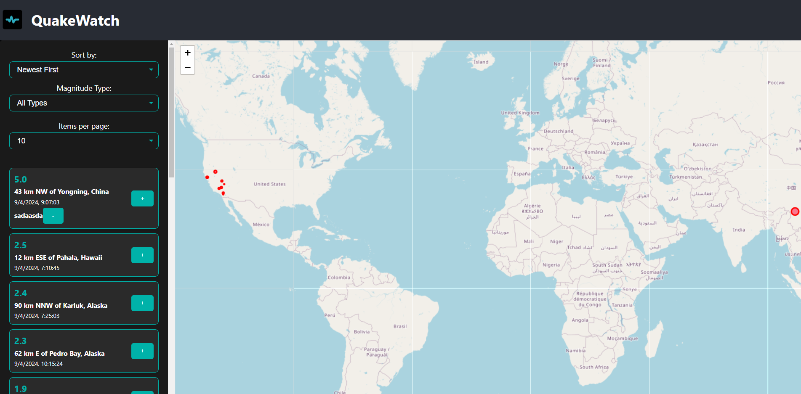
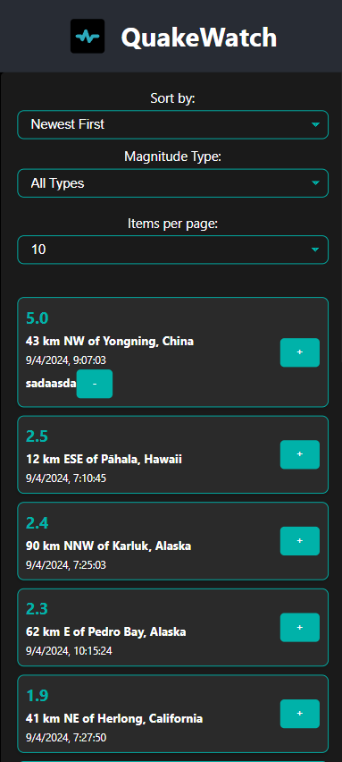

# QuakeWatch Frontend

## Description
QuakeWatch is a web application that visualizes real-time earthquake data, utilizing a Ruby on Rails backend to serve data from the USGS API. This frontend is built with React and TypeScript, providing an interactive user interface for data visualization.

### Screenshots
#### Desktop Version
<p align="center">
  
</p>

#### Mobile Version
<p align="center">
  
</p>

## Environment Setup
### Requirements
- Node.js
- npm or yarn

### Installation
Clone the repository and install the dependencies:
```bash
git clone https://github.com/jorge-holguin/QuakeViewFrontend.git
```
```bash
cd QuakeWatch/frontend
npm install
```

### Configuration
Ensure to set up the necessary environment variables in .env, including the backend URL.

### Usage
To start the local development server:
```bash
npm start
```
View the application in action by visiting http://localhost:3001. It is recommended to use port 3001 to avoid conflicts with the backend.

### Deployment
Instructions for deploying on Netlify:

1. **Build your project:** First, you need to compile your React application into static files that can be served. Run the following command in your project directory:
   ```bash
   npm run build
    ```
    This command generates a build directory with all the static files.

2. **Set up on Netlify:** Log into Netlify and create a new site by linking your GitHub repository. Choose to deploy from the main branch.

3. **Configure Environment Variables:** In the Netlify dashboard, set the necessary environment variables such as API endpoints or any other secrets your application requires.

4. **Deploy:** Follow Netlify’s prompts to deploy your application. Netlify will automatically deploy your application each time you push changes to the main branch.

### Contributions
Contributions are welcome. Please send your pull requests to the main branch.

### License
MIT License